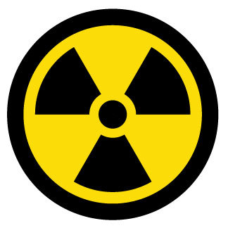

# Reactor

A Slack bot that guesses crowd reactions to your messages.



[](https://heroku.com/deploy?template=https://github.com/kujenga/reactor/tree/master)

## Getting Started

Retrieve this repository with:

```bash
go get github.com/kujenga/reactor
```

Check out the instructions for the Boston Golang [Slack lab](https://github.com/bostongolang/golang-lab-slack) for info on how to get properly setup a slack bot.

When you have an API key, setup your shell with the following command, substituting in your token:

```bash
export SLACK_TOKEN="<my_slack_token>"
```

Then, you can run the bot with:

```bash
go run main.go
```
